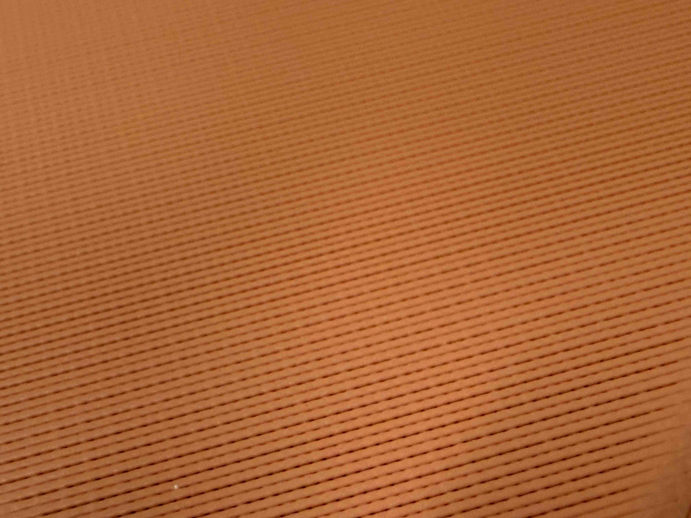

+++
date = '2025-12-15T13:27:28-06:00'
draft = true
title = 'Solid 3d Printing'
categories = [
    "Technical"
]
tags = [
    "3D Printing",
]
+++

# 3D Printing with 100% infills for larger parts

For a normal FDM 3D printer, usually the objects printed is for the visual or functional prototype and the inner part does not matter that much. So the infill of a print is usually for supporting the structure and it does not require a high infill percentage. Even for some functional parts, usually a smaller infill percentage is preferred for the sake of filament cost and printing time. 100% infill is required only in some specific situations and one of those is printing solid phantom to achieve certain HU value under CT scans.

FDM 3D printing phantom for CT and linac was a thing I was asked to do. Although there are a lot of publications on this topic since probably 2010, I still had some hard time to figure out the printing part and I found that printing a "fully solid" object poses very different technical challenge from just printing weird stuff in general. As it does not look like some of the experience I gained is going to be included in any publication, I might use it to populate the blog a bit lmao. If it happens that you found yourself in a similar situation or you are working with the same printer/filament, this at least would provide a datapoint for your reference.

## Configs

The printer I used for printing large solid objects is a Prusa XL with two tool heads. The reason for choosing this printer was mainly the printable volume of 360 mm cubed. One of the tools (tool 0) has a 0.8 mm nozzle while the other one has 0.4 mm nozzle.

The filament I have been using is PLA. This should be the easiest filament to work with but still I had quite some problem when printing this kind of objects. The products I used are Sunlu highspeed PLA, Prusament PLA, Polymaker Polylite PLA pro, Polymaker Polylight LW-PLA (prefoamed), Formfutura Stonefil PLA.

The object I was trying to print is about the size of a head so the scale of the printings are about 20 cm. Many of the tests and trials were made on something a few cm or 10 cm scales.

I was using PrusaSlicer for almost all the stuff I printed. I tried OrcaSlicer with the maximum flow rate test and the extrusion multiplier test for other purpose. These are handy and helped me understand how 3D printers work.

## Wrapping

Usually PLA is not known for wrapping but it seems like it wraps anyways. The reason is very likely the 100% infill.

The wrap causes the print to fail in our case. There are multiple failure modes. First is for Prusa XL, if the nozzle is too close to the surface it is printing on, the filament could not be extruded as smooth as it should be and this would make the pressure in the nozzle to be high, which could trigger the filament stuck sensor. Second is if the wrap is too bad the nozzle could collide with the thing you are printing. If this happens the best possible outcome is layer shift, and by this I mean the print will fail.

What I found to work for me is turning off the fan. And check this lift before obstacle thing in the slicer. Could avoid some collision in my experience.

for the filaments I have played with, the Polymaker Polylite LW-PLA is absolutely the worst. This filament I only printed with the 0.4 mm nozzle as it is not recommended to print is using bigger nozzle if I remember correctly. 

## Infill pattern

Well, we don't really have many options if we are printing with 100% infill. One thing we can still tune is the anchoring. You can see the difference. 

In my experience, with anchoring, there would be too much filament stacking near the perimeter which could trigger the filament stuck sensor. I suspect that this might make the wrapping problem worse (like, if the line in the infill shrinks, with anchor it applies stronger force on the perimeter), but I have no evidence. 

## Density and flow rate

This is studied by multiple papers and is actually kinda hard to control. When the nozzle is traveling, you can see how 

## Thoughts

OK this is fun but not really a "proper" way of using FDM 3d printing. A more proper way would be pixelprint but nah.

One of the good thing is that for Core XY printers your object is not moving all the time and your extruder does not really gets havier as the print goes on. It seems like Core XY is gaining popularity anyways, I suppose more because of the speed.

I have a Elegoo centauri carbon and it is amazing although I did not use it to print full solid stuff.

I did not use LLM when I was writing this. You get to see how shitty my writing is. I would say it's below reddit average.

